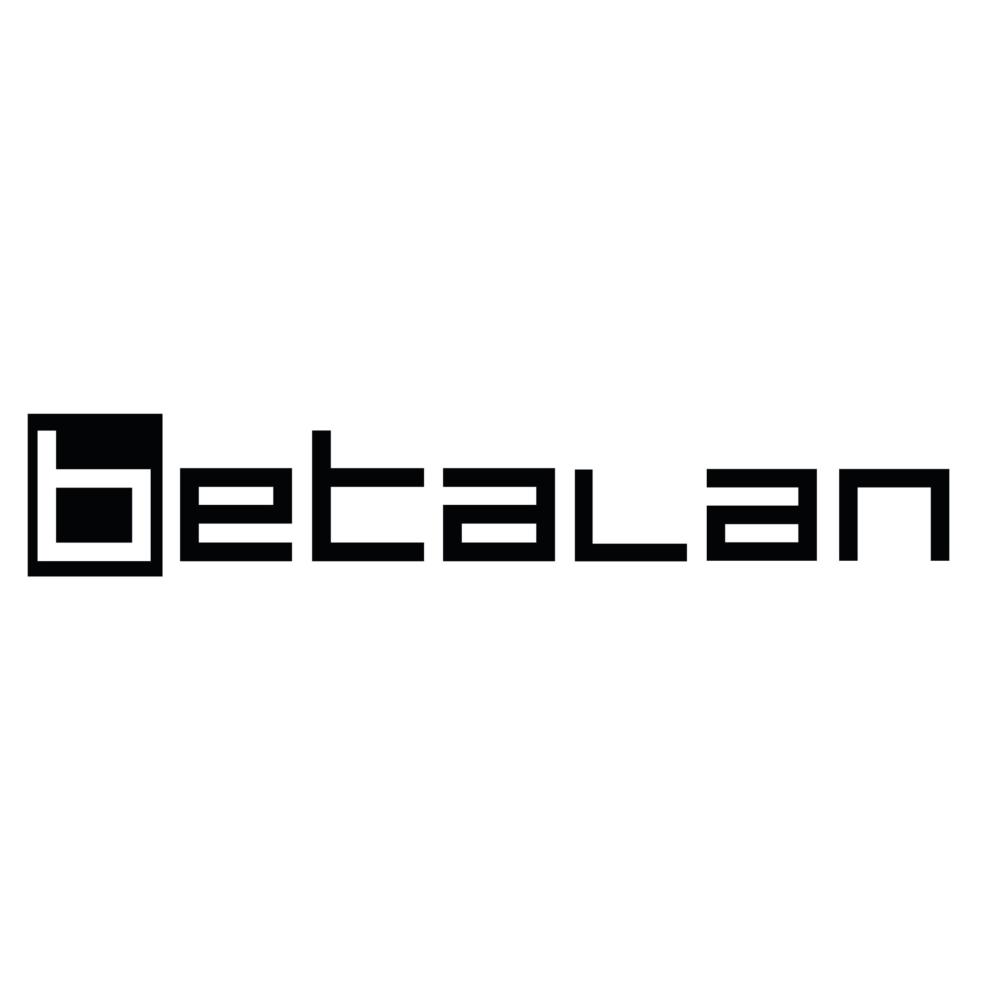
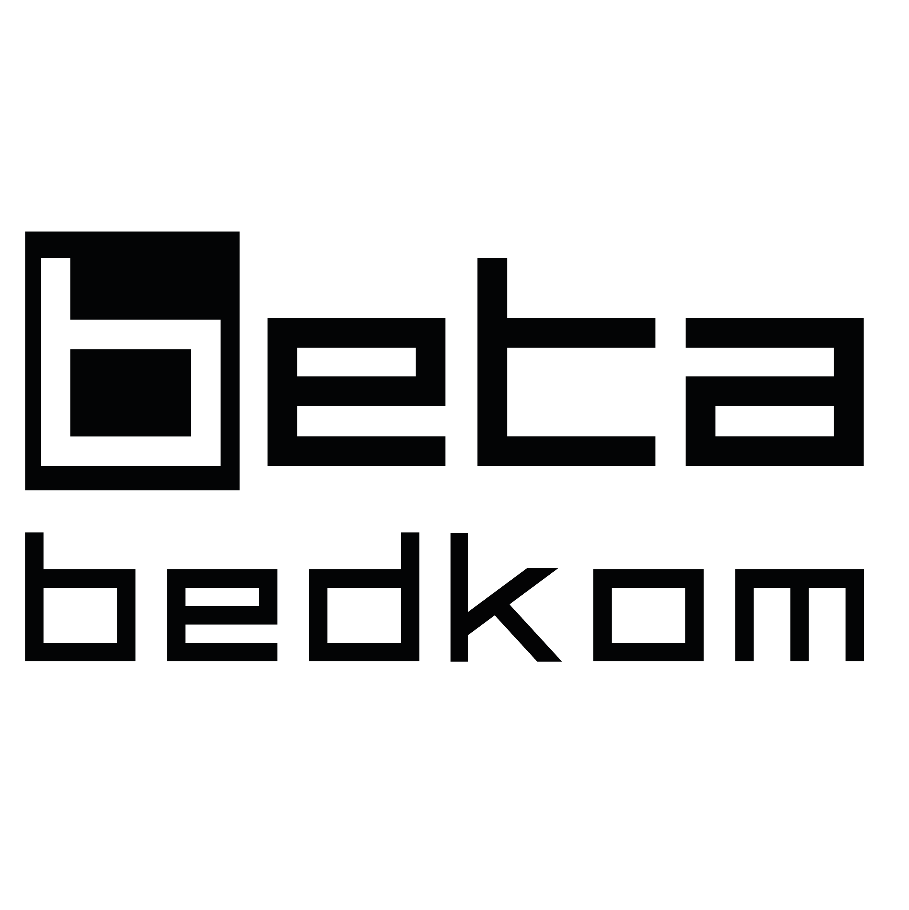
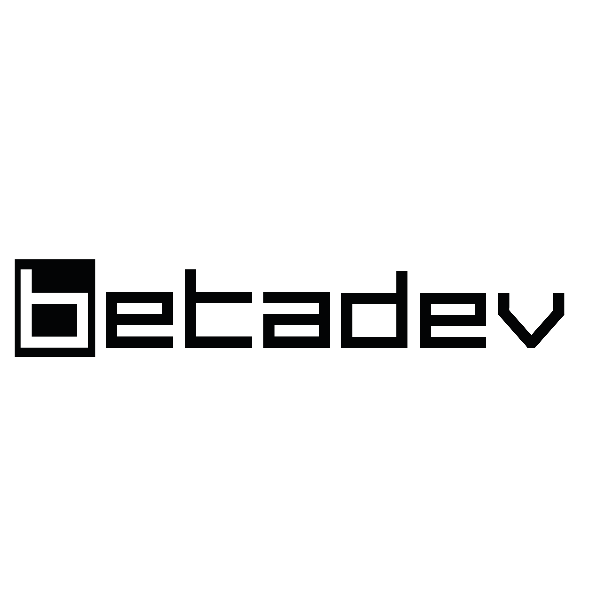

# branding
logos and a simple brand book for BETA

* [BETA](#BETA)
* [BETALAN](#BETALAN)
* [BEDKOM](#BEDKOM)
* [EVENTKOM](#EVENTKOM)
* [BETADEV](#BETADEV)
* [BETASEC](#BETASEC)
* [COLORS](#COLORS)

---
## BETA

## BETALAN

## BEDKOM

## EVENTKOM

## BETADEV

## BETASEC

# COLORS
| Color                                  | HEX     | C    | M   | Y   | K   |
| -------------------------------------- | ------- | ---- | --- | --- | --- |
|   | #0085ff | 100% | 48% | 0%  | 0%  |
|  | #ffffff | 0%   | 0%  | 0%  | 0%  |